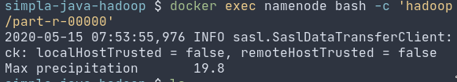
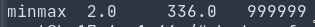
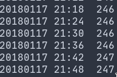
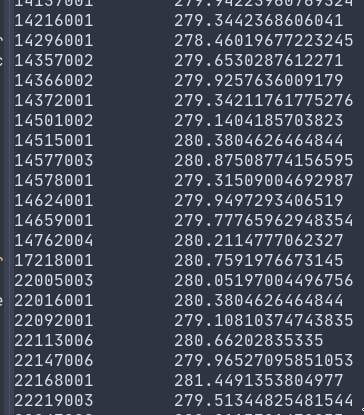
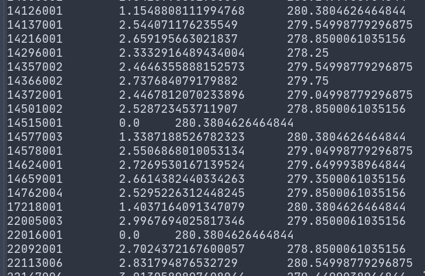
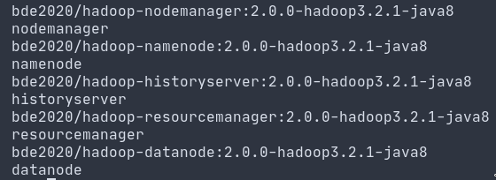
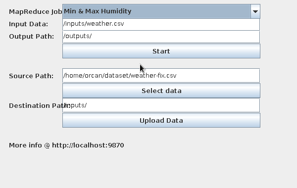
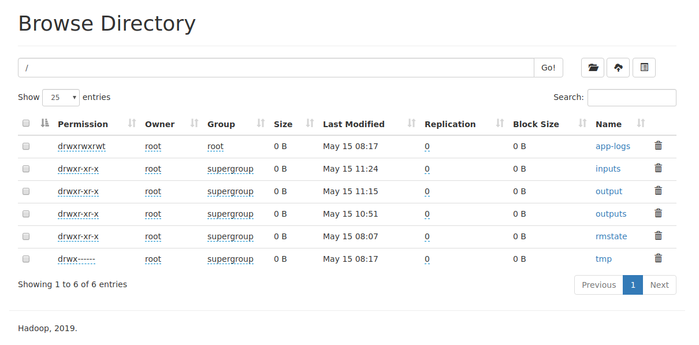

# Simpla Java Hadoop

In this project, 5 different statistical method implemented via MapReduce
technique using dockerized containers and Java Hadoop Client.

## Dataset

In this project, 5 different statistical method implemented via MapReduce
technique using dockerized containers and Java Hadoop Client.

## MapReduce Algorithms

### Max Precipitation

This algorithm intended to help the maximum precipitation in records for easy
comparison between the current time. The mapper doesn’t hold a specific key so
the algorithm reduces all the information to a one row. 

### Min-Max Humidity Range

This algorithm intended to show the highest range between minimum and maximum
temperature. Like the Max Precipitation, the algorithm does not store any
specific key to reducing to one row. The numbers are respectively, the min, the
max, and total number of instances.

### Number of Measurements on Each Timestamp

This algorithm helps to protect or check the data integrity. Because of the
existence of a specified interval in the documentation, the calculations must be
correct for those intervals. This algorithm calculates the number of
measurements in each time stamp.

### Average of the Temperatures

This algorithm calculates average temperatures for each measurement station.
This calculation made by grouping the key of station numbers and reducing them
to their averages. The temperature values are in Kelvin.

### Standard Deviation of the Temperatures

This algorithm helps to understand the climate by showing the variety of the
temperatures in each measurement station. The numbers are the station number,
standard deviation of the temperatures, mean of the temperatures respectively.

## Implementation

The project is implemented in two main parts. One is dockerized hadoop
environment. The other one is operational Java environment. All the components
is bundled using a _Makefile_. In order to launch the environment and the java
project the only thing to do is type `make run` in the project directory. If
there is no make utility available, the commands should be manually be typed in
a command line. There must be _Docker_, _Docker Compose_ and maven installed in
the system.

The development of the docker environment is simplified using _Docker Compose_
and prebuilt Java containers. There are 5 containers needed to be launched to
run a proper hadoop environment. The container, named namenode is the master of
the structure. Datanode is a slave node for hadoop. Datanodes can be multiple
and be launched via _Docker Compose_. The other nodes are the resource managers.

All the execution results can be monitored also using the native web service of
the Hadoop and Yarn. The default settings are `http://localhost:9870` for the
Hadoop and `http://localhost:8088` for the Yarn.

Files are uploaded using the native Java API of the Hadoop with the **HDFS
protocol**. The experiment environment implemented in insecure mode. So there
will be no need to require any authentication.

Execution of the jobs are handled via mapping a shared folder between local
machine and docker namenode instance. The Java part of the project generates a
command line script to run the jar of the job programmatically. In this process
I could not handle the standard out stream. So even if the command runs
successfully, there are no output like executing in the command line.

GUI part of the project implemented using **Swing**. The GUI has capable of
uploading files to HDFS and runs the specified jobs. Because of the lacking of
capability of displayin the output, the user have to be check the operation
using the native web services of the libraries.

## Performance

When the number of nodes are low, performance of a HDFS system is slow in
comparison between a single node system. In a simulated environment like in this
project, the difference of the performance is more dramatic. In the examples,
summing a one million numbers takes one minute. The replication system is more
effective when there are many nodes as possible.

## Reference

- [MeteoNet Dataset host](https://www.kaggle.com/katerpillar/meteonet) 
- [Datasets documentation](https://meteofrance.github.io/meteonet/) 
- [Command references](https://www.tutorialspoint.com/hadoop/hadoop_command_reference.htm)

